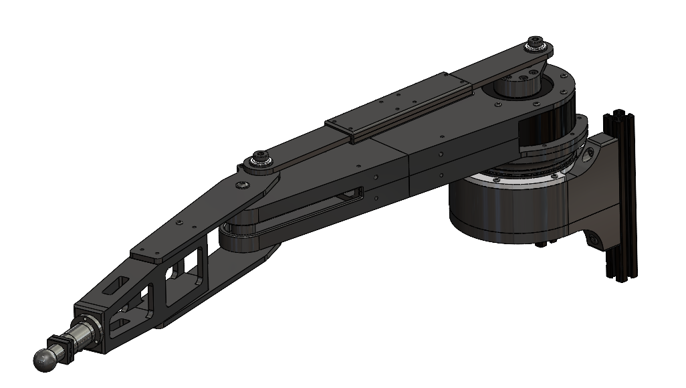

# LevionArm

This repository contains required packages to control "Levion Arm", which is equipped on the Floating Platform for Zero-G lab at University of Luxembourg.



## Installation

Clone the repo including submodules under the workspace.

```bash
mkdir -p levion_ws/src
cd levion/src
```

```bash
git clone --recurse-submodules -j8 git@github.com:aky-u/LevionArm.git
```

> [!NOTE]
> If you have cloned without submodules, use the following command to clone submodules.
>
> `git submodule update --init --recursive`

Install required packages.

```bash
rosdep install --from-paths src --ignore-src -r -y
```

> [!NOTE]
> If you have'nt setup rosdep, initialize it with the command below.
>
> ```bash
> sudo rosdep init
> rosdep update
> ```

## Build

```bash
cd .. # move to workspace
colcon build --symlink-install
```

## Setup CAN with Holybro

```bash
sudo modprobe mttcan
sudo ip link set can0 type can bitrate 1000000
sudo ip link set can0 up
```

## Set zero position

```bash
cansend can0 00000568#01 # 104
```

```bash
cansend can0 000005CC#01 # 204
```

## Run single motor test

```bash
source install/setup.bash
ros2 launch levion_arm_ros2_control ak80_8..launch.py # launch single motor controller with default type = position
```

```bash
source install/setup.bash
ros2 launch levion_arm_ros2_control ak80_8..launch.py controller_type:=forward_velocity_controller # launch velocity controller
```

```bash
source install/setup.bash
ros2 launch levion_arm_ros2_control ak80_8..launch.py controller_type:=forward_effort_controller # launch effort controller
```

### Launch the arm

```bash
source install/setup.bash
ros2 launch levion_arm_ros2_control levion_arm.launch.py # launch single motor controller with default type = position
```

```bash
source install/setup.bash
ros2 launch levion_arm_ros2_control levion_arm.launch.py controller_type:=forward_velocity_controller # launch velocity controller
```

```bash
source install/setup.bash
ros2 launch levion_arm_ros2_control levion_arm.launch.py controller_type:=forward_effort_controller # launch effort controller
```

## ID map

BN:1088230509 = 104 {0x68}

BN:1088230418 = 105 {0x69}

BN:1088221109 = 204 {0xCC}

## AK Series

[Cubemars support](https://www.cubemars.com/article.php?id=261)

- [AK80-8](https://www.cubemars.com/goods-1151-AK80-8.html)

## Related works

- <https://github.com/neurobionics/TMotorCANControl>

- <https://github.com/dfki-ric-underactuated-lab/mini-cheetah-tmotor-python-can>

- <https://github.com/SherbyRobotics/tmotor_ros>

- <https://github.com/OpenFieldAutomation-OFA/cubemars_hardware/tree/main>

## Trouble shooting

- [If Motor Failed Entering Both Modes](https://www.cubemars.com/article-330-If+Motor+Failed+Entering+Both+Modes.html)

<!-- > [!WARNING]
> -->
