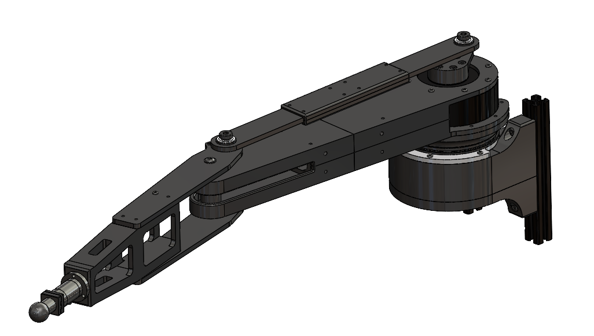

# LevionArm

This repository contains required packages to control "Levion Arm", which is equipped on the Floating Platform for Zero-G lab at University of Luxembourg.



## Installation

Clone the repo including submodules under the workspace.

```bash
mkdir -p levion_ws/src
cd levion/src
```

```bash
git clone --recurse-submodules -j8 git@github.com:aky-u/LevionArm.git
```

> [!NOTE]
> If you have cloned without submodules, use the following command to clone submodules.
>
> `git submodule update --init --recursive`

Install required packages.

```bash
rosdep install --from-paths src --ignore-src -r -y
```

> [!NOTE]
> If you have'nt setup rosdep, initialize it with the command below.
>
> ```bash
> sudo rosdep init
> rosdep update
> ```

## Build

```bash
cd .. # move to workspace
colcon build --symlink-install
```

## Setup CAN with Holybro

```bash
sudo modprobe mttcan
sudo ip link set can0 type can bitrate 1000000
sudo ip link set can0 up
```

## Set zero position

```bash
cansend can0 00000568#01 # 104
cansend can0 00000569#01 # 105
cansend can0 000005CC#01 # 204
cansend can0 000005CD#01 # 205
```

> [!NOTE]
> The encoder offset can be configured via the ros2_control parameter in [cubemars_hardware](https://github.com/aky-u/cubemars_hardware/tree/895332cbe19519a8229270f5b44764a187459e5b?tab=readme-ov-file#ros2_control-parameters). In this repository, it is set to 0.349 or -0.349, depending on whether the arm is the left or right one. This value is defined under the assumption that the motor is zeroed (calibrated) when the arm is fully extended and positioned at its mechanical limit, as illustrated in the cover image of this README. See [levion.property.xacro](levion_arm_ros2_control/description/config/levion.property.xacro) for details.

## Run single motor test

```bash
source install/setup.bash
ros2 launch levion_arm_ros2_control ak80_8..launch.py # launch single motor controller with default type = position
```

```bash
source install/setup.bash
ros2 launch levion_arm_ros2_control ak80_8..launch.py controller_type:=forward_velocity_controller # launch velocity controller
```

```bash
source install/setup.bash
ros2 launch levion_arm_ros2_control ak80_8..launch.py controller_type:=forward_effort_controller # launch effort controller
```

### Launch the arm

```bash
source install/setup.bash
ros2 launch levion_arm_ros2_control levion_arm.launch.py # launch single motor controller with default type = position
```

```bash
source install/setup.bash
ros2 launch levion_arm_ros2_control levion_arm.launch.py controller_type:=forward_velocity_controller # launch velocity controller
```

```bash
source install/setup.bash
ros2 launch levion_arm_ros2_control levion_arm.launch.py controller_type:=forward_effort_controller # launch effort controller
```

## ID map

BN:1088230509 = 104 {0x68} : Left shoulder

BN:1088230418 = 105 {0x69} : Left elbow

BN:1088221109 = 204 {0xCC} : Right shoulder

BN:1088230509 = 205 {0xCD} : Right elbow

## AK Series

[Cubemars support](https://www.cubemars.com/article.php?id=261)

- [AK80-8](https://www.cubemars.com/goods-1151-AK80-8.html)

## Related works

- <https://github.com/neurobionics/TMotorCANControl>

- <https://github.com/dfki-ric-underactuated-lab/mini-cheetah-tmotor-python-can>

- <https://github.com/SherbyRobotics/tmotor_ros>

- <https://github.com/OpenFieldAutomation-OFA/cubemars_hardware/tree/main>

## Trouble shooting

- [If Motor Failed Entering Both Modes](https://www.cubemars.com/article-330-If+Motor+Failed+Entering+Both+Modes.html)

<!-- > [!WARNING]
> -->
